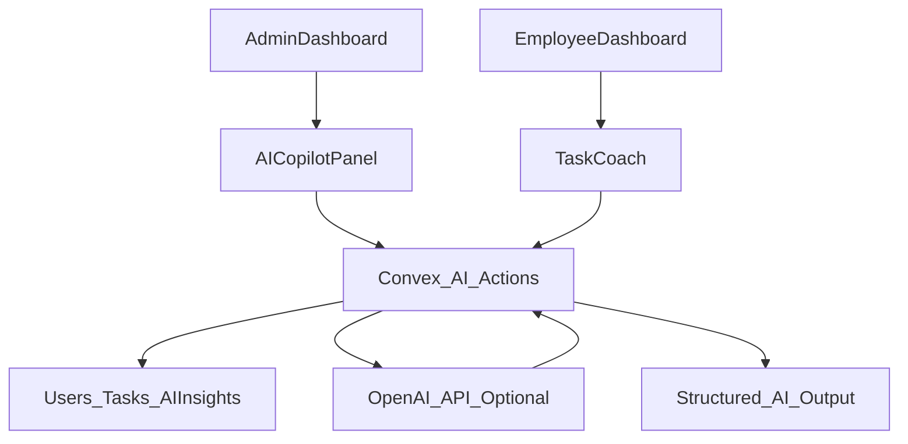

# TaskTracker AI Operations Copilot

TaskTracker is an AI-powered internal workflow tool for managers and employees. It started as an enterprise task tracker and now includes an AI Operations Copilot that summarizes team execution, detects delivery risk, recommends manager actions, and drafts employee follow-ups.

This project is designed for the Klaviyo AI Builder Resident application. It demonstrates the ability to turn an ambiguous internal productivity problem into a shipped AI workflow automation with a real frontend, backend, database, deployment path, and clear demo story.

## Live Demo

Live application: [https://task-tracker-phi-tawny.vercel.app](https://task-tracker-phi-tawny.vercel.app)

Repository: `Fadma1234/TaskTracker`

## Problem

Managers often have task data spread across dashboards, status updates, and employee conversations. The raw task list shows what exists, but it does not answer the questions managers ask every day:

- What changed?
- What is blocked?
- Which work should I prioritize first?
- Who needs a follow-up?
- What should I say to them?

TaskTracker AI turns task data into an actionable operating brief.

## Solution

The app supports two roles:

- Admins create tasks, assign work, monitor employees, delete tasks, delete employees, and generate AI team briefs.
- Employees view assigned tasks, update status, and use an AI task coach to break work into next steps.

The AI layer provides:

- Team summaries with workload and completion context.
- Blocker detection for overdue, stale, and high-priority work.
- Priority recommendations for manager action.
- Follow-up drafts for employee check-ins.
- Employee task coaching with suggested next steps and status update drafts.

## AI Workflow



If `OPENAI_API_KEY` is configured in Convex, the app calls an LLM from the server. If no key is configured, it uses deterministic fallback rules so reviewers can still demo the full workflow without secrets.

## Core Features

- Admin dashboard with real-time task statistics.
- Task creation, assignment, filtering, searching, status updates, and deletion.
- Employee performance cards and employee deletion.
- AI Operations Copilot for team execution briefs.
- Employee AI Task Coach for task breakdowns and status drafts.
- Convex backend with real-time data and server-side AI actions.
- Vercel-ready frontend configuration.

## Tech Stack

- Frontend: React, TypeScript, Vite, Tailwind CSS
- Backend: Convex database, queries, mutations, and actions
- AI: OpenAI-compatible chat completion API via Convex server action
- Deployment: Vercel frontend and Convex production backend

## Project Structure

```text
TaskTracker/
├── convex/
│   ├── ai.ts                 # AI team brief and task coach actions
│   ├── auth.ts               # Demo auth user creation and lookup
│   ├── dashboard.ts          # Dashboard aggregation queries
│   ├── schema.ts             # Users, tasks, and aiInsights tables
│   ├── tasks.ts              # Task queries and mutations
│   └── users.ts              # Employee queries and deletion mutation
├── src/
│   ├── components/
│   │   ├── AICopilotPanel.tsx
│   │   ├── TaskCoach.tsx
│   │   ├── TaskCard.tsx
│   │   ├── TaskForm.tsx
│   │   └── Dashboard.tsx
│   ├── pages/
│   │   ├── AdminDashboard.tsx
│   │   ├── EmployeeDashboard.tsx
│   │   ├── Login.tsx
│   │   └── Tasks.tsx
│   └── lib/
│       └── convex.ts
├── DEPLOYMENT.md
├── QUICK_DEPLOY.md
├── VERCEL_SETUP.md
└── vercel.json
```

## Setup

Install dependencies:

```bash
npm install
```

Start Convex locally:

```bash
npx convex dev
```

Start the frontend:

```bash
npm run dev
```

Open the Vite local URL, create an admin account, create employee accounts, assign tasks, then generate an AI team brief from the admin dashboard.

## Environment Variables

Frontend:

```text
VITE_CONVEX_URL=http://127.0.0.1:3210
```

Production Vercel should use your Convex cloud URL:

```text
VITE_CONVEX_URL=https://your-project.convex.cloud
```

AI configuration is server-side in Convex:

```bash
npx convex env set OPENAI_API_KEY your_openai_key
npx convex env set OPENAI_MODEL gpt-4o-mini
```

`OPENAI_API_KEY` is optional for demos because the app has deterministic fallback analysis.

## Demo Script

1. Log in as an admin.
2. Create two employee accounts.
3. Assign several tasks with different priorities and due dates.
4. Mark one task in progress and leave another overdue or stale.
5. Open the admin dashboard and click `Generate Team Brief`.
6. Show the AI summary, risks, recommended actions, and follow-up drafts.
7. Log in as an employee and click `Coach Me` on a task.
8. Show the suggested next steps and status update draft.

## Why This Matters

This project demonstrates the core AI Builder skill set:

- Translating a business workflow into an AI-powered product.
- Building full-stack functionality across frontend, backend, data, and deployment.
- Keeping AI secrets server-side.
- Designing graceful fallbacks for reliable demos.
- Producing actionable output instead of generic chatbot responses.

## Production Notes

- Demo authentication uses localStorage and email-based user lookup. A production version should use Clerk, Auth0, Convex Auth, or another identity provider.
- The AI prompts are scoped to task and employee metadata stored in Convex.
- The OpenAI key is never exposed to the browser.
- Deployment instructions are available in `DEPLOYMENT.md`, `QUICK_DEPLOY.md`, and `VERCEL_SETUP.md`.

## Future Improvements

- Add proper authentication and organization-level tenancy.
- Add notification integrations for Slack or email.
- Add audit logs for AI-generated follow-ups.
- Add human approval workflow before sending messages.
- Add embeddings/RAG for company policy or project documentation.

## License

MIT
